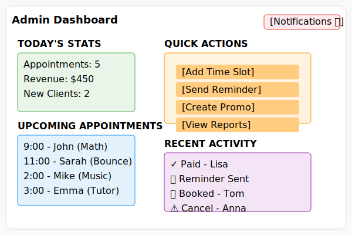
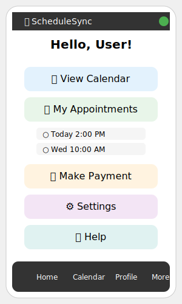

# ScheduleSync - Smart Business Scheduler

[My Notes](notes.md) 

A comprehensive scheduling application for family-run businesses that handles appointments, payments, and client management automatically.

## ✅ Prerequisites Met
- **Simon React deployed:** https://simon.scheduling.click (Fully interactive with login, game play, and scores)
- **GitHub link:** https://github.com/DaftFunk123/Self-Hosted-Freelance-LLC-Website (in footer of all pages)
- **Git commits:** 10+ commits per deliverable

## 🌐 Live Sites
- **Simon React (Prerequisite):** https://simon.scheduling.click
- **Startup React (Main Deliverable):** https://startup.scheduling.click

## 🚀 Elevator Pitch

ScheduleSync is the smart scheduling assistant for family-run businesses. Imagine having a personal secretary who manages your appointments, sends automatic reminders, enforces your policies, and processes payments—all while you focus on delivering exceptional service. Whether you're renting bounce houses, tutoring students, or running any service-based business, ScheduleSync eliminates scheduling headaches and ensures you never miss a booking or payment again.

## ✨ Key Features

- **Smart Availability**: Set your working hours with one click; the system automatically blocks out personal events
- **Policy Enforcement**: Automated late fees, cancellation charges, and rescheduling rules
- **Payment Integration**: Secure automatic charging for appointments and deposits
- **Client Portal**: Clients can book, reschedule, and view their appointment history
- **Automated Workflow**: Reminder emails/SMS, review requests, and promotional tracking
- **Multi-Business Support**: One account can manage multiple business types (tutoring, rentals, etc.)

## 🛠 Technology Implementation

### HTML
The application will use semantic HTML5 elements for structure. We'll have multiple HTML pages including a landing page, login/registration pages, client dashboard, and business owner admin panel. Each page will be properly structured with headers, navigation, main content areas, and footers. Forms will use appropriate input types for dates, times, emails, and phone numbers.

### CSS
We'll implement a responsive design that works on mobile, tablet, and desktop using Flexbox and CSS Grid. The styling will include custom color themes for different business types, smooth animations for modal transitions and hover effects, consistent component styling across the application, and special print styles for invoices and confirmations.

### React
The frontend will be built as a single-page application using React. We'll create reusable components including a CalendarView for date selection, AppointmentForm for booking, ClientDashboard for appointment management, and AdminPanel for business settings. React Router will handle navigation between different views, and we'll use React Context for managing global state like user authentication.

### Service (Backend)
The backend service will provide multiple RESTful endpoints including:
- User authentication (register, login, logout)
- Business management (create/update business profiles)
- Appointment scheduling (check availability, book, reschedule, cancel)
- Payment processing (create payment intents, confirm payments)
- Client management (send reminders, request reviews)

We'll integrate with the OpenWeatherMap API to check weather conditions. For outdoor services like bounce house rentals, the system will automatically warn about rain forecasts and suggest rescheduling options.

### Database
We'll store application data in a MongoDB database. This includes:
- User accounts with authentication credentials
- Business profiles with service offerings, pricing, and policies
- Appointment records with status, timing, and payment information
- Promotion codes and their usage tracking
- Reminder logs and review request history

### WebSocket
WebSocket connections will enable real-time features in the application. When a business owner updates their availability, connected clients will immediately see the changes without refreshing. Business owners will receive instant notifications when new appointments are booked. The system will also show live warnings if multiple users are considering the same time slot simultaneously.

## 🎨 Design Sketches

### Landing Page

*Homepage where users can select a business type or log into their account.*

### Booking Interface

*Calendar view showing available time slots with service selection options.*

### Admin Dashboard

# 🚀 HTML Deliverable

### Files Created:
- `index.html` - Main homepage with navigation and all technology placeholders
- `booking.html` - Appointment booking interface with calendar
- `admin.html` - Business owner dashboard with statistics
- `login.html` - User authentication forms
- `profile.html` - Placeholder for user profiles

### Technology Placeholders Implemented:
- **Third-party API**: Weather integration section for OpenWeatherMap
- **Database Data**: Appointment tables showing mock MongoDB data
- **WebSocket**: Live updates section for real-time notifications
- **Authentication**: Login/registration forms with user session management

### Design Elements:
- SVG design sketches embedded on relevant pages:
  - `landing-page.svg` - Homepage design
  - `booking-interface.svg` - Calendar booking interface
  - `admin-dashboard.svg` - Business owner dashboard
  - `mobile-view.svg` - Mobile responsive design

### Deployment:
- Live at: https://startup.scheduling.click
- Deployed using `deployFiles.sh` script
- All navigation links functional
- Images loading correctly

### Git Commits:
Multiple commits showing progressive development of the HTML structure.

*Business owner view showing appointments, revenue, and management controls.*

### Mobile View

*Responsive mobile interface for on-the-go booking.*

# 🚀  CSS Deliverable

### What I Did for CSS Deliverable:
- [x] **CSS Framework**: Added Bootstrap 5.3 via CDN and created custom `framework.css` with utility classes
- [x] **Custom CSS**: Created `styles.css` with CSS variables, animations, and responsive design
- [x] **Responsive Design**: Implemented flexbox for navigation and grid for layouts with media queries
- [x] **Imported Fonts**: Added Google Fonts (Poppins for body, Montserrat for headings)
- [x] **Selector Variety**: Used element, class, ID, and pseudo-class selectors throughout
- [x] **Visual Polish**: Added hover effects, animations, shadows, and consistent color scheme

### Files Modified:
- `styles.css` - Main styles with responsive design and animations
- `framework.css` - Bootstrap-like utility classes and components
- `index.html`, `booking.html`, `admin.html`, `login.html` - Updated with CSS links

### CSS Features Implemented:
- Mobile-responsive navigation (flexbox)
- Grid-based stats dashboard on admin page
- Form styling with focus states
- Table improvements with hover effects
- Animation on page load (fade-in sections)
- Hover animations for interactive elements

### Technologies Used:
- **Bootstrap 5.3** - CSS framework via CDN
- **Google Fonts** - Poppins and Montserrat
- **CSS Grid** - For calendar and stats layouts
- **Flexbox** - For responsive navigation
- **CSS Variables** - For consistent theming
- **Media Queries** - For mobile responsiveness

### Deployment:
- Live at: https://startup.scheduling.click
- Simon CSS deployed at: https://simon.scheduling.click
- All CSS files properly linked and loading

# 🚀 React Phase 1 Deliverable

### What I Did for React Conversion:
- [x] **Vite Setup**: Initialized project with Vite for frontend tooling and bundling
- [x] **React Components**: Converted all HTML/CSS to React components (Home, Booking, Admin, Login, Profile)
- [x] **React Router**: Implemented SPA navigation with React Router DOM
- [x] **Bootstrap Integration**: Added React Bootstrap for component styling
- [x] **Production Build**: Configured Vite for production builds with `npm run build`

### Files Created/Modified:
- `startup-react-p1/` - New React project directory
- `src/app.jsx` - Main App component with header, footer, and routing
- `src/pages/Home/Home.jsx` - Homepage component
- `src/pages/Booking/Booking.jsx` - Booking interface component
- `src/pages/Admin/Admin.jsx` - Admin dashboard component
- `src/pages/Login/Login.jsx` - Login component
- `src/pages/Profile/Profile.jsx` - Profile component
- `index.html` - SPA entry point
- `index.jsx` - React entry point
- `deployReact.sh` - React-specific deployment script

### Challenges Overcome:
- **DNS clientHold Saga**: Domain was suspended, required verification through AWS
- **Caddy Configuration**: Multiple iterations to get static file serving working correctly
- **Path Issues**: Fixed deployment script to use absolute paths (`/services/startup/public`)
- **CSS Visibility**: Footer was hidden due to missing padding - fixed with proper CSS
- **React Imports**: Ensured all components properly import React and their CSS

### React Features Implemented:
- **Functional Components**: All components use modern React function syntax
- **React Router**: Navigation between pages without page reloads
- **Component Composition**: Header and footer in App component, page content in route components
- **Import/Export**: Proper ES6 module syntax throughout

### Deployment:
- **Simon React**: https://simon.scheduling.click
- **Startup React**: https://startup.scheduling.click
- **Deployment Script**: `./deployReact.sh -k /c/Users/HP/Downloads/funkberry.pem -h scheduling.click -s startup`

### Git Commits:
Multiple commits over several days showing progressive development of the React conversion.

# 🚀 React Phase 2 Deliverable

### 📱 What Users Can Now Do
- **Login:** Demo accounts: `admin/admin123`, `jason/password`, `demo/demo`
- **Home Page:** Welcome message + persistent visit counter
- **Booking:** Multi-step form to schedule appointments
- **Admin Dashboard:** View/edit appointments + live mock notifications
- **Profile:** Edit and save user information

### What I Did for React Phase 2:
- [x] **Authentication System**: Implemented login/logout with `useState` and `localStorage`
- [x] **Protected Routes**: Used `Navigate` to restrict access to Booking, Admin, and Profile pages
- [x] **Persistent Counter**: Added `useEffect` to save/load visit count from `localStorage`
- [x] **Mock API Calls**: Simulated data loading with `setTimeout` and loading spinners
- [x] **Interactive Admin Dashboard**: Editable appointment status with real-time updates
- [x] **Live Notifications**: Mock WebSocket messages using `setInterval`
- [x] **Multi-step Booking Form**: State management across 3 steps with form validation
- [x] **Profile Editor**: Editable user profile with `localStorage` persistence
- [x] **Conditional Rendering**: Navbar changes based on login state

### Technologies Used:
- **React Hooks**: `useState`, `useEffect` for all component logic
- **React Router**: `BrowserRouter`, `Routes`, `Route`, `Navigate`, `NavLink`
- **Bootstrap**: Styling and responsive components
- **LocalStorage**: Client-side data persistence
- **JavaScript**: Arrow functions, array methods, destructuring, conditional logic

### Challenges Overcome:
- Vite module cache issues on Windows
- Relative vs absolute import paths
- State management across multiple components
- Lifting state up for authentication
- Mocking real-time features with `setInterval`

### Deployment:
- **Simon React**: https://simon.scheduling.click
- **Startup React**: https://startup.scheduling.click
- **GitHub**: https://github.com/DaftFunk123/Self-Hosted-Freelance-LLC-Website
